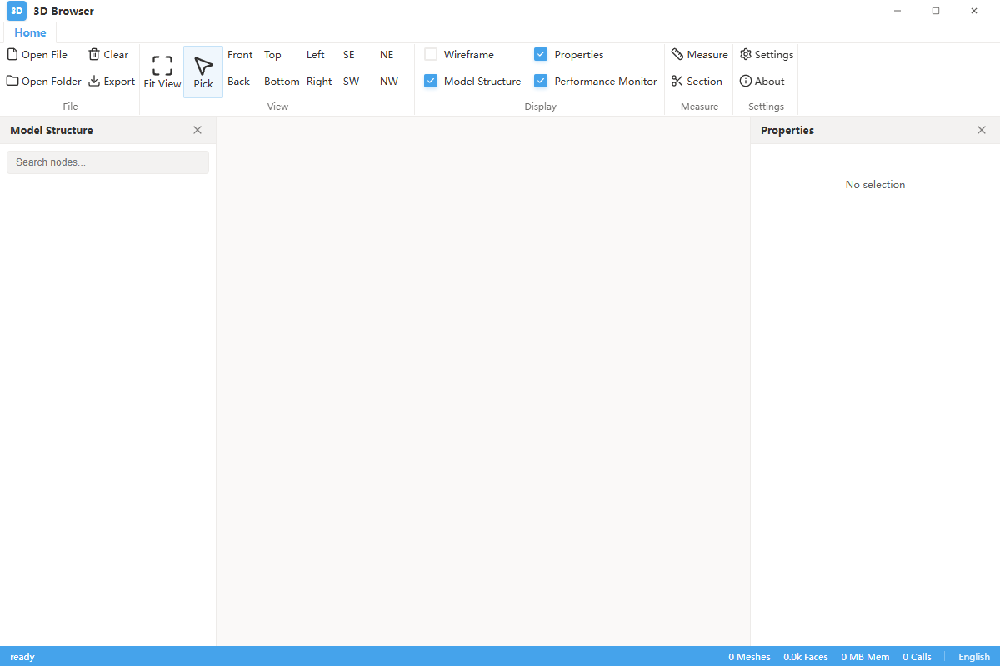
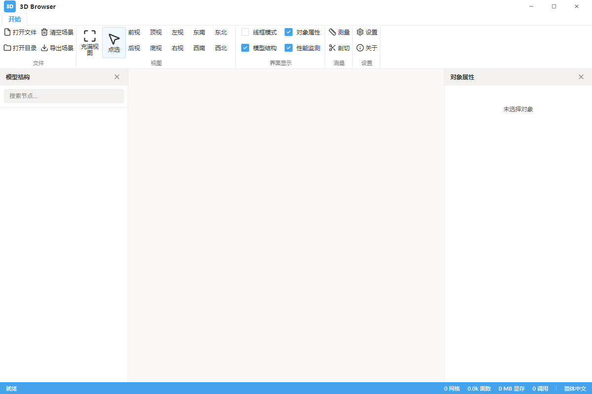

# @zhangly1403/3dbrowser

Professional 3D model viewer library for React and Web applications.

## UI Preview

<div align="center">
  
</div>

## Key Features

- **High-Performance Rendering**: Powered by **NBIM** and **BatchedMesh**, capable of rendering 100,000+ meshes smoothly.
- **Multi-format Support**: IFC, GLB/GLTF, 3D Tiles, FBX, OBJ, and LMB.
- **Advanced Tools**: Measurement (distance, angle, coords), sectioning (clipping planes), and scene structure tree.
- **Responsive & Modern**: Built with React 19, Three.js, and TypeScript.
- **Bilingual**: Built-in support for English and Chinese.

## Installation

```bash
npm install @zhangly1403/3dbrowser
```

## Quick Usage

```tsx
import { ThreeViewer } from '@zhangly1403/3dbrowser';

function App() {
  return (
    <div style={{ width: '100vw', height: '100vh' }}>
      <ThreeViewer />
    </div>
  );
}
```

## Advanced Usage

### SceneManager

The `SceneManager` class provides low-level control over the 3D scene:

```typescript
import { SceneManager } from '@zhangly1403/3dbrowser';

const manager = new SceneManager(canvasElement);
manager.loadNbim('path/to/model.nbim');
```

## License

### Free for Non-Commercial Use (Commercial Use Prohibited)

This project is intended for learning and research purposes only. **Commercial use of any kind is strictly prohibited**. For commercial licensing, please contact the original author for authorization.

---

# @zhangly1403/3dbrowser (中文)

专业的 React 3D 模型浏览器组件库。

## 界面预览

<div align="center">
  
</div>

## 特色功能

- **高性能渲染**: 基于 **NBIM** 和 **BatchedMesh** 技术，支持 10 万级构件流畅渲染。
- **多格式支持**: 支持 IFC, GLB/GLTF, 3D Tiles, FBX, OBJ, LMB 等。
- **高级工具**: 测量（距离、角度、坐标）、剖切（剪切面）、场景结构树。
- **现代技术栈**: 基于 React 19, Three.js 和 TypeScript 构建。
- **双语支持**: 内置中英文支持。

## 安装

```bash
npm install @zhangly1403/3dbrowser
```

## 快速上手

```tsx
import { ThreeViewer } from '@zhangly1403/3dbrowser';

function App() {
  return (
    <div style={{ width: '100vw', height: '100vh' }}>
      <ThreeViewer />
    </div>
  );
}
```

## 许可证

### 非商业用途免费（禁止用于商业目的）

本项目仅供学习和研究使用，**禁止用于任何商业目的**。如需商业使用，请联系原作者获得授权。
