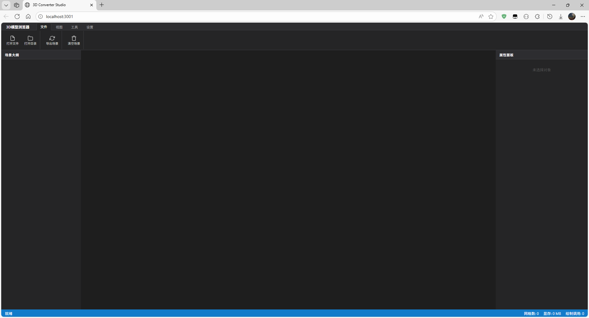

# 3D Browser / 3D 浏览器

<div align="center">
  
  <p><em>Modern 3D model viewer built with React and Three.js / 基于React和Three.js构建的现代化3D模型查看器</em></p>
</div>

## 🌟 Features / 功能特性

### English
- **3D Model Viewer**: Load and display various 3D model formats
- **Interactive Controls**: Rotate, zoom, and pan around 3D models
- **Scene Management**: Organize and manage multiple 3D objects
- **Properties Panel**: View and edit object properties in real-time
- **Settings Panel**: Customize viewer settings and preferences
- **Responsive Design**: Works on desktop and mobile devices

### 中文
- **3D 模型查看器**: 加载和显示多种 3D 模型格式
- **交互式控制**: 旋转、缩放和平移 3D 模型
- **场景管理**: 组织和管​​理多个 3D 对象
- **属性面板**: 实时查看和编辑对象属性
- **设置面板**: 自定义查看器设置和偏好
- **响应式设计**: 支持桌面和移动设备

## 🛠️ Tech Stack / 技术栈

| Category / 类别 | Technologies / 技术 |
|----------------|-------------------|
| Frontend / 前端 | React 19, TypeScript |
| 3D Engine / 3D引擎 | Three.js |
| Build Tool / 构建工具 | Vite |
| 3D Formats / 3D格式 | Support for various 3D file formats / 支持多种3D文件格式 |
| Styling / 样式 | CSS-in-JS with modern design / CSS-in-JS现代设计 |

## 📋 Prerequisites / 系统要求

- **Node.js** (version 16 or higher / 版本16或更高)
- **npm** or **yarn** package manager / npm或yarn包管理器

## 🚀 Installation / 安装指南

### English
1. Clone the repository:
   ```bash
   git clone <repository-url>
   cd 3dbrowser
   ```

2. Install dependencies:
   ```bash
   npm install
   ```

3. Set up environment variables (if needed):
   ```bash
   # Copy the example environment file
   cp .env.local.example .env.local
   
   # Edit .env.local and add your API keys if required
   ```

4. Start the development server:
   ```bash
   npm run dev
   ```

5. Open your browser and navigate to `http://localhost:5173`

### 中文
1. 克隆仓库：
   ```bash
   git clone <仓库地址>
   cd 3dbrowser
   ```

2. 安装依赖：
   ```bash
   npm install
   ```

3. 设置环境变量（如需要）：
   ```bash
   # 复制示例环境文件
   cp .env.local.example .env.local
   
   # 编辑 .env.local 并添加所需的 API 密钥
   ```

4. 启动开发服务器：
   ```bash
   npm run dev
   ```

5. 打开浏览器并访问 `http://localhost:5173`

## 📖 Available Scripts / 可用脚本

| Command / 命令 | Description / 描述 |
|---------------|------------------|
| `npm run dev` | Start development server / 启动开发服务器 |
| `npm run build` | Build for production / 构建生产版本 |
| `npm run preview` | Preview production build / 预览生产构建 |

## 📁 Project Structure / 项目结构

```
3dbrowser/
├── components/          # React components / React组件
│   ├── ConfirmModal.tsx     # Confirmation modal / 确认模态框
│   ├── LoadingOverlay.tsx   # Loading overlay / 加载遮罩
│   ├── MenuBar.tsx          # Menu bar / 菜单栏
│   ├── PropertiesPanel.tsx  # Properties panel / 属性面板
│   ├── SceneTree.tsx        # Scene tree / 场景树
│   ├── SettingsPanel.tsx    # Settings panel / 设置面板
│   └── ToolPanels.tsx       # Tool panels / 工具面板
├── images/              # Screenshots and preview images / 截图和预览图片
│   ├── preview1.png         # Main application preview / 主应用预览
│   └── ...
├── public/              # Static assets / 静态资源
├── src/                 # Source code / 源代码
│   ├── index.tsx        # Main application entry / 主应用入口
│   ├── SceneManager.ts  # 3D scene management / 3D场景管理
│   └── ...
├── package.json         # Project configuration / 项目配置
├── tsconfig.json       # TypeScript configuration / TypeScript配置
└── vite.config.ts      # Vite configuration / Vite配置
```

## 🖼️ Screenshots / 截图展示

<div align="center">

### Main Interface / 主界面

*3D Browser main interface with scene tree and properties panel / 3D浏览器主界面，包含场景树和属性面板*

### 3D Model Viewing / 3D模型查看

*Interactive 3D model viewing with camera controls / 交互式3D模型查看，支持相机控制*

</div>

## 🎯 Key Components / 主要组件说明

### English
- **SceneManager.ts**: Responsible for 3D scene creation, management, and rendering
- **MenuBar.tsx**: Provides main navigation and operation menu
- **PropertiesPanel.tsx**: Displays and edits selected object properties
- **SceneTree.tsx**: Shows hierarchical structure of all objects in the scene
- **SettingsPanel.tsx**: Application settings and preference configuration

### 中文
- **SceneManager.ts**: 负责 3D 场景的创建、管理和渲染
- **MenuBar.tsx**: 提供应用的主要导航和操作菜单
- **PropertiesPanel.tsx**: 显示和编辑选中对象的属性
- **SceneTree.tsx**: 展示场景中所有对象的层级结构
- **SettingsPanel.tsx**: 应用设置和偏好配置

## 🔧 3D Features / 3D功能特性

### English
- Support for multiple 3D model format loading
- Camera controls (rotation, zoom, pan)
- Real-time scene rendering and performance optimization
- Object selection and interaction functionality

### 中文
- 支持多种 3D 模型格式加载
- 提供相机控制（旋转、缩放、平移）
- 实时场景渲染和性能优化
- 对象选择和交互功能

## 🤝 Contributing / 贡献指南

### English
1. Fork the repository
2. Create a feature branch: `git checkout -b feature/amazing-feature`
3. Commit your changes: `git commit -m 'Add amazing feature'`
4. Push to the branch: `git push origin feature/amazing-feature`
5. Open a pull request

### 中文
1. Fork 本仓库
2. 创建功能分支：`git checkout -b feature/新功能`
3. 提交更改：`git commit -m '添加新功能'`
4. 推送到分支：`git push origin feature/新功能`
5. 提交 Pull Request

## 📝 Development Tips / 开发建议

### English
- Use TypeScript for type safety
- Follow React Hooks best practices
- Maintain Three.js scene optimization and performance
- Use responsive design for multi-device compatibility

### 中文
- 使用 TypeScript 确保类型安全
- 遵循 React Hooks 最佳实践
- 保持 Three.js 场景的优化和性能
- 使用响应式设计确保多设备兼容

## 📄 License / 许可证

This project is licensed under the MIT License - see the LICENSE file for details.

本项目采用 MIT 许可证 - 详见 LICENSE 文件。

---

<div align="center">
  <p>Built with ❤️ using React, Three.js, and Vite</p>
  <p>使用 React、Three.js 和 Vite 构建，用心打造</p>
</div>